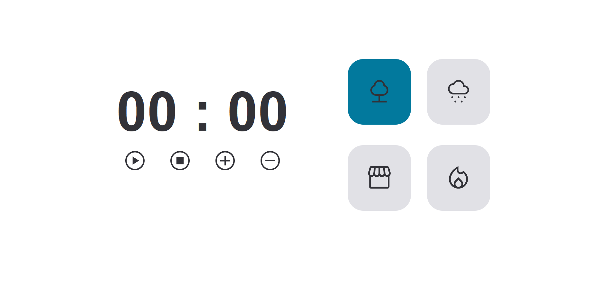

<h1 align="center"> Focus Timer 2.0 </h1>

Projeto promovido pela rocketseat para ensino de tecnologias WEB.

  <a href="#-tecnologias">Tecnologias</a>&nbsp;&nbsp;&nbsp;|&nbsp;&nbsp;&nbsp;
  <a href="#-projeto">Projeto</a>&nbsp;&nbsp;&nbsp;|&nbsp;&nbsp;&nbsp;
  <a href="#-layout">Layout</a>&nbsp;&nbsp;&nbsp;|&nbsp;&nbsp;&nbsp;
  <a href="#memo-licença">Licença</a>

  

 

  

[🔗 Clique aqui para acessar](https://devleuuon.github.io/focusTimer2.0/)

## 🚀 Tecnologias

Esse projeto foi desenvolvido com as seguintes tecnologias:

- HTML, CSS e Javascript
- Git e Github
- Figma

## 💻 Projeto

Projeto para melhorar a prática e os conhecimentos.

## 🔖 Layout
Você pode visualizar o layout do projeto através [DESSE LINK](https://www.figma.com/file/6jVU8ZOJ84CLp2ZdL2vCrN/Stage-05---Focus-Timer-2.0-(Copy)?type=design&node-id=0-4&mode=design&t=8A08xpmyN9NH2ZaD-0) para acessá-lo.

## 📝 Licença

Esse projeto está sob a licença MIT.